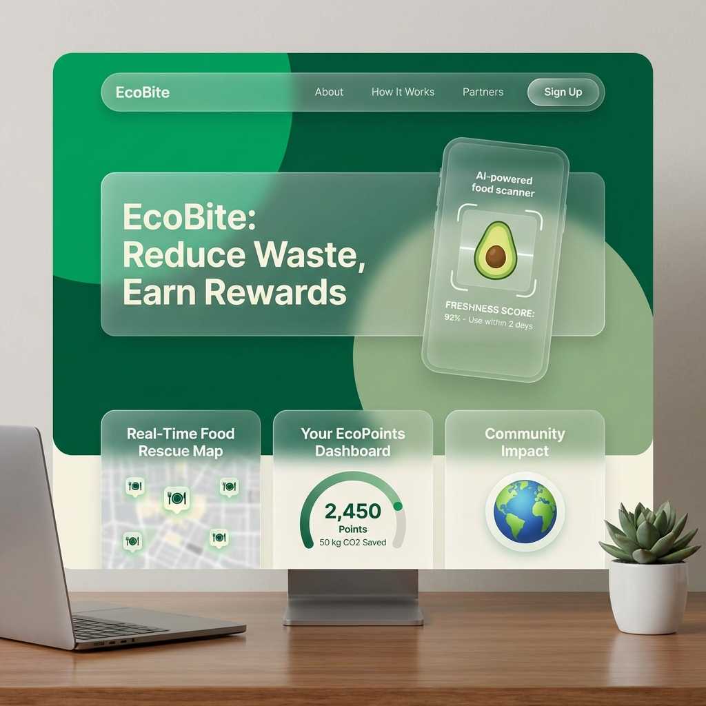

# 🌱 EcoBite: Revolutionizing Food Sustainability

### 🚀 Imagine Cup 2026 | Azure-Powered Social Impact

EcoBite is a cutting-edge digital ecosystem designed to eliminate food waste by intelligently connecting donors with those in need. By leveraging the power of **Microsoft Azure**, we've built a scalable, secure, and AI-driven platform that transforms surplus food into community impact.



---

## 🌟 Key Features

### 👁️ AI-Powered Quality Assurance
Never guess freshness again. Our integrated **Azure AI Vision** system automatically detects food types and calculates freshness scores from uploaded photos, ensuring only high-quality food reaches the community.

### 🗺️ Real-Time Smart Logistics
Visualize the impact in real-time. Built with **Azure Maps**, our interactive dashboard connects Restaurants, NGOs, and Individuals through a live spatial interface that tracks donation hotspots and pickup requests.

### 💰 EcoPoints Ecosystem
Every bite counts. Users earn **EcoPoints** for every action that reduces waste. These points track your personal contribution to reducing CO2 emissions and can be used to unlock rewards and community recognition.

### 🔐 Enterprise-Grade Security
Your data is protected by the same technology powering the world's largest companies. We use **Microsoft Entra ID (Azure AD)** for secure, seamless authentication across all user roles.

### 📈 Manual Payment Verification
Transparency first. Our donation system supports multiple payment methods (JazzCash, EasyPaisa, Card) with a manual verification workflow. Users upload payment proofs, which are reviewed by admins to ensure integrity and award EcoPoints fairly.

### 📊 Multi-Role Ecosystem
Specialized dashboards tailored for:
- **Restaurants & Food Businesses**: Efficiently list surplus and track tax-deductible contributions.
- **NGOs & Animal Shelters**: Request specific food types and manage distribution.
- **Individuals**: Donate surplus meals and volunteer for local pickups.
- **Fertilizer Plants**: Receive non-consumable waste for organic composting.

---

## 🛠️ Technology Stack

| Layer | Technology |
|---|---|
| **Frontend** | React, Vite, Framer Motion, Tailwind CSS, Lucide Icons |
| **Backend** | Node.js, Express |
| **Database** | **Azure SQL Database** (Cloud-Native Persistence) |
| **Cloud Services** | **Azure AI Vision**, **Azure Maps**, **Azure Identity** |
| **Integrations** | Stripe, JazzCash, Twilio (SMS), Nodemailer (Alerts), Cloudinary (Images) |

---

## 🚀 Getting Started

### Prerequisites
- Node.js 20.x
- An Azure Subscription (for cloud features)

### Installation

1. **Clone the repository**
   ```bash
   git clone https://github.com/Saadia-Asghar/Ecobite_.git
   cd ecobite
   ```

2. **Install dependencies**
   ```bash
   npm install
   ```

3. **Configure Environment Variables**
   Create a `.env` file in the root directory based on `.env.example`.

4. **Start the Development Server**
   ```bash
   npm run dev
   ```
   *This starts both the React frontend and the Express backend concurrently.*

---

## 📉 Sustainable Development Goals (SDGs)
EcoBite is proud to align with the United Nations SDGs:
- **SDG 2: Zero Hunger**: Directing nutritious food to those in need.
- **SDG 12: Responsible Consumption**: Drastically reducing global food waste.
- **SDG 13: Climate Action**: Mitigating methane emissions from decomposing food waste.

---

**Built for a Greener Tomorrow by Team Wizard.js.**

